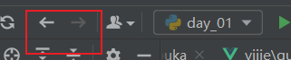

数据整体流程
1 前端静态页面  （通过 js 携带参数向后端发送请求）
2 后端服务根据参数请求数据库
3 拿到数据进行处理 返回
4 前端拿到数据 进行渲染

 
.print  tab  快捷打印
ctrl  + d  快速复制
alt + 左键选中 批量操作
alt +enter  快速导入包
 前后导航

### 变量名称定义
- 避免使用内置关键字 （import keyword; keyword.kwlist）
- 避免使用内置的包名

### 基本数据类型
- Number（数字）    int
- 
- String（字符串）  str
  - 单引号
  - 双引号
  - 三单引号 长文本可换行
  - 三双引号 长文本可换行
- bool（布尔类型）  True  False （其实属于数字类型的子集 俗称 smallInt）
- 
- List（列表）      list  [1,2,3, 'ssdad', {1: 2}, {1,2,3}]
  - 排序 a = [{1: 2}, {2: 1}, {3: 2}]
  - 排序 a.sort(key=lambda i: list(i.items())[0])  原地排序 没有返回值
  - b = sorted(a, key=lambda i: list(i.items())[0]) 有返回值
  
- Tuple（元组）    tuple
- 
- Set（集合）      set
- 
- Dictionary（字典）  dict
  - a = {1: 2}
  - key值有说法 只有不可变类型才能作为key值

深浅拷贝
浅拷贝 只拷贝第一层   copy  藕断丝连
深拷贝 完全独立      deepcopy

